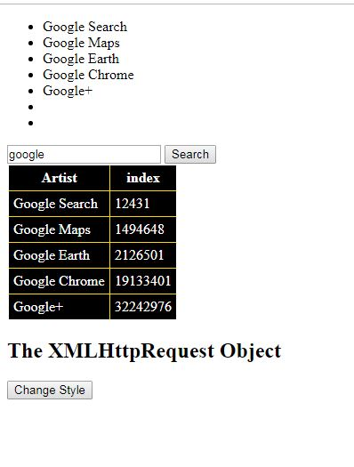

## App name: 
#### Small Search Engine

## Search_with_wikipedia_API_asnync
(my First applactin using wikipedia API)

## What I need To Run the code and see result?:
1. You need only web browser all thing ready.
2. I added HTML, CSS and Javascript codes togther to make it easy run on browsers without any edits.

## project components:
1. HTML (Create Page).
2. CSS (layout).
3. JavaScript (user AJAX and get response from wikipedia server also print out result).
4. AJAX technique (connect asynchronously with wikipedia server)(no need reload page).
5. wikipedia_API (var url in code).

## about:
1. this application connect to wikipedia server asynchronously no need to reload (FaceBook Style).
2. it has search input and search button.
3. click on search button will execute function loadDoc and create new XMLHttpRequest().
4. it has javascript function to change table style.
5. also has methods and for loops to append the pageid and title to two arrays myPages and ids.
6. then it will push myPages and ids contents and print it into new table.
7. using AJAX make all things happens asynchronously even with onload.
6. also there is method to print myPages and ids to <ul> (Not Good for undefined search results numbers).  

## app(Result):
1. take inputs or search topic from user.
2. print the result using wikipedia_API and pageid.

## screenshoot:

